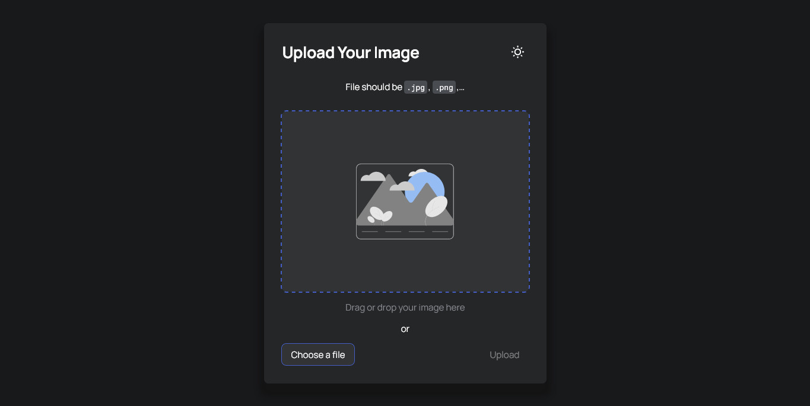

<!-- Please update value in the {}  -->

<h1 align="center">Image Uploader</h1>

<div align="center">
   Solution for a challenge from  <a href="http://devchallenges.io" target="_blank">Devchallenges.io</a>.
</div>

<div align="center">
  <h3>
    <a href="https://{your-demo-link.your-domain}">
      Demo
    </a>
    <span> | </span>
    <a href="https://{your-url-to-the-solution}">
      Solution
    </a>
    <span> | </span>
    <a href="https://devchallenges.io/challenges/O2iGT9yBd6xZBrOcVirx">
      Challenge
    </a>
  </h3>
</div>

<!-- TABLE OF CONTENTS -->

## Table of Contents

- [Overview](#overview)
  - [Built With](#built-with)
- [Features](#features)
- [How to use](#how-to-use)
- [Contact](#contact)
- [Acknowledgements](#acknowledgements)

<!-- OVERVIEW -->

## Overview



### Built With

- [React](https://reactjs.org/)
- [styled-components](https://styled-components.com/)
- [PostgreSQL](https://www.postgresql.org/)
- [Jest](https://jestjs.io/)

## Features

This application/site was created as a submission to a [DevChallenges](https://devchallenges.io/challenges) challenge. The [challenge](https://devchallenges.io/challenges/O2iGT9yBd6xZBrOcVirx) was to build an application to complete the given user stories:

 - I can drag and drop an image to upload it
 - I can choose to select an image from my folder
 - I can see a loader when uploading
 - When the image is uploaded, I can see the image and copy it
 - I can choose to copy to the clipboard

## How To Use

To clone and run this application, you'll need [Git](https://git-scm.com) and [Node.js](https://nodejs.org/en/download/) (which comes with [npm](http://npmjs.com)) installed on your computer. From your command line:

```bash
# Clone this repository
$ git clone https://github.com/vietan0/dc-image-uploader

# Install dependencies
$ npm i && cd client && npm i

# Run the app
$ npm run dev
```

## Contact

- GitHub [@vietan0](https://github.com/vietan0/)
- Twitter [@vietan00892b](https://twitter.com/vietan00892b)
